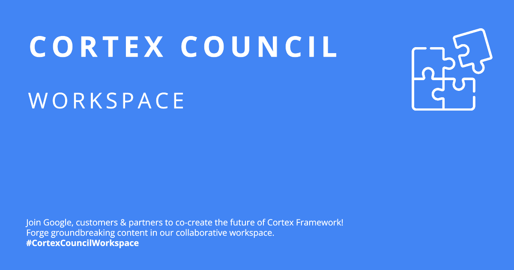

## **Cortex Council Workspace**

El espacio de trabajo de Cortex Council es su centro de innovación para Google Cloud Cortex Framework. 
Este espacio colaborativo reúne a las mentes más brillantes de Google, nuestros valiosos clientes y socios pioneros. ¿Nuestra misión? 

Co-crear contenido nuevo e innovador que supere los límites de Cortex Framework.

**El Cortex Council Workspace fomenta:**

Desarrollo colaborativo: trabaje hombro con hombro con Google, clientes y socios innovadores, creando la próxima generación de contenido de Cortex Framework.

Sinergia de experiencia: contribuya con su conocimiento y experiencia únicos para impulsar el futuro de Cortex Framework.

Innovación más rápida: aproveche el poder de la colaboración para generar ideas, crear prototipos y hacer realidad sus ideas a un ritmo acelerado.

El Cortex Council Workspace da la bienvenida a todos.

## **Acerca de Cortex**

La base de datos para [Google Cloud Cortex Framework](https://cloud.google.com/solutions/cortex) es un conjunto de artefactos analíticos que se pueden implementar automáticamente junto con arquitecturas de referencia.

El repositorio actual contiene documentación sobre las vistas y modelos analíticos que sirven como capa de datos fundamental para Google Cloud Cortex Framework en BigQuery.

## **Licencia**
Este código fuente tiene licencia Apache 2.0. El texto completo de la licencia está disponible en [LICENSE](https://github.com/CortexCouncilWorkspace/CCWSite/blob/main/LICENSE).